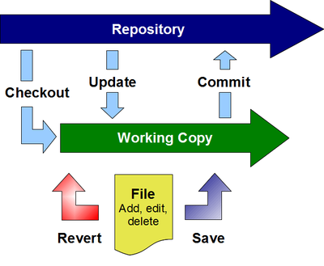

Gruff Goat Information Services (GGIS) ceased operations as of December 2017. At this time, only a few former clients are still receiving pro-bono support and these are slowly migrating to other services.

## How-to: Email Configuration for Outlook 2002

### Purpose

To receive email from the new server, some settings must be created or changed in your email client (Outlook). This How-To assumes you are using Outlook 2002 as your email client. If you are using a different client, you may still understand what settings you need to make be reviewing this How-To.

### Settings

*   POP3 server : *deprecated*
    *   Requires SSL
    *   Uses port 995
*   SMTP server : *deprecated*
    *   Requires SMTP Authentication
    *   Uses port 587
*   IMAP server : *deprecated*
    *   Requires SSL
    *   Uses port 993

### Take Precautions

I suggest renaming any current email account you wish to change by appending 'OLD' to the name. Then, do not make changes to the OLD account but instead add a new account. Once you are satisfied with the results of your new accounts, you may delete any unneeded OLD accounts.

### Three Ways to Collect Email

The email server offers three options for managing email. These are web mail, POP, and IMAP.

Squirrelmail
: The webmail software is called Squirrelmail and allows you to manage all of your email via any internet connection.

POP
: POP is a method of accessing electronic mail that allows an email client program (Outlook) to download messages to the client computer. POP works best when one uses a single computer, wherein messages are downloaded and then deleted from the mail server. POP is the method currently used to access email. If you are satisfied with the current email system, then please choose the POP option.

IMAP
: IMAP provides access to email that is kept on the mail server. In other words, it permits a client email program (Outlook) to access remote messages as if they were local. For example, email stored on an IMAP server can be manipulated from a desktop computer at home, a workstation at the office, and a notebook computer while traveling, without the need to transfer messages or files back and forth between these computers.

If you are likely to use multiple computers, extensively utilize web mail, or wish your email to remain stored on the mail server, then choose the IMAP option. Choosing IMAP may mean that you have a few new tricks to learn to fully manage its capabilities.

### A Word about User Names

User names can sometimes be confusing. You may have more than one username including, a login username for your computer or network, and a username for your email account. These are separate items. The gogoat email server requires that your username include your domain. Using a typical login name of **jjones** and a domain of **domain.com** for example:

*   Email address = jjones@domain.com
*   The email username is jjones@domain.com which is the same as your email address.
*   The nickname portion of the username is jjones
*   The domain of the username is domain.com

### Step-by-step

#### Setting your password

Choose a password that is a least 6 characters and not a dictionary word. GGIS will occasionally audit password suitability and may require overly simple passwords to be changed. Additionally, please do not use the same password as you use for your work login.

1.  Visit web site *deprecated* (very important to use https)
2.  Enter your User Account, this is the nickname portion of your new email username
3.  Enter your Domain Name, this is the domain of your new email username
4.  Enter your password, your initial password is the same as the nickname portion of your new email username
5.  Click Login
6.  Enter your new password into the 2 password boxes
7.  Click Modify User
8.  Click Logout

#### Accessing Email Account Settings in Outlook

1.  Open Outlook
2.  Select Tools > Email Accounts
3.  Select View or change existing e-mail accounts
4.  Click Next
5.  Select the appropriate email account
6.  Click Change.

#### Renaming your Current Outlook Account

1.  Access your account settings
2.  Click More Settings
3.  Select the General tab
4.  Rename your account
5.  Click OK
6.  Click Next
7.  Click Finish

#### Create a New Account

1.  Open Outlook
2.  Select Tools > Email Accounts
3.  Select Add a new email account
4.  Click Next
5.  Select either POP3 or IMAP
6.  Click Next

#### Creating a POP3 Account

1.  Create a new account
2.  In the Setting dialog enter the following information:
    *   Your Name:
    *   Email Address: loginname@yourdomain.com (substitute your real email address)
    *   Incoming mail server (POP3): : *deprecated*
    *   Outgoing mail server (SMTP): : *deprecated*
    *   Username: nickname@yourdomain (substitute your new email username)
    *   Password: ****** (the password you created while 'Setting your password')
    *   Remember password: (your choice)
3.  Click More Settings
4.  Select the General tab
    *   Enter the applicable information
5.  Select the Outgoing Server tab
    *   Check My outgoing server (SMTP) requires authentication
    *   Check Use same settings as my incoming mail server
6.  Select the Advanced tab
    *   Under Incoming server (POP3), check This server requires an SSL-secured connection (SSL)
    *   Verify that the box next to Incoming server (POP3) changed to 995
    *   Change the box next to Outgoing server (SMTP) to 587
7.  Click OK
8.  Click Next
9.  Click Finish
10.  Please make certain to change your default account (see below)

#### Creating an IMAP Account

1.  Create a new account
2.  In the Setting dialog enter the following information:
    1.  Your Name:
    2.  Email Address: loginname@yourdomain.com (substitute your real email address)
    3.  Incoming mail server (IMAP): : *deprecated*
    4.  Outgoing mail server (SMTP): : *deprecated*
    5.  Username: nickname@yourdomain (substitute your new email username)
    6.  Password: ****** (the password you created while 'Setting your password')
    7.  Remember password: (your choice)
3.  Click More Settings
4.  Select the General tab
    1.  Enter the applicable information
5.  Select the Outgoing Server tab
    1.  Check My outgoing server (SMTP) requires authentication
    2.  Check Use same settings as my incoming mail server
6.  Select the Advanced tab
    1.  Under Incoming server (IMAP), check This server requires an SSL-secured connection (SSL)
    2.  Verify that the box next to Incoming server (IMAP) changed to 993
    3.  Change the box next to Outgoing server (SMTP) to 587
7.  Click OK
8.  Click Next
9.  Click Finish
10.  Please make certain to change your default account (see below)

Change Your Default Account

1.  Open Outlook
2.  Select Tools > Email Accounts
3.  Select the account you wish to be your default
4.  Click Set as Default
5.  Click Finish

## How-to: Version Control for the General Users

Many different types of version control exist. This How-to is not meant to be exhaustive but to guide general users in the basic concepts and usage of version control software. It is intended for users of Subversion but many of the concepts are easily extended to include GIT and Mercurial.

### What's the purpose?

Version control software manages changes to documents and other computer files. It allows for easy tracking of changes, collaboration on the same documents, and distribution of controlled versions of a document.

#### Consider the example

Company Alpha has 5 employees who work in the product department, some in the Canada office and some in the USA office. Alpha also collaborates with Contractor Beta and Consultant Gamma, each of which has multiple employees. Alpha has created a marvelous new product but that product is not yet fully developed. In order to get its product to market quickly, Alpha decides to start documenting its product while still in development. The documentation has been outsourced to Gamma. Additionally, Beta will perform testing on the product and its documentation. Since this is an important product, the division president wishes to always have the latest results from all collaborators readily available.

A central repository that allows users to work on a copy of the documentation and then submit or merge changes to the repository is needed. This is exactly the type of scenario that version control software was designed for.

### Concepts

*   File data and revision history is stored in the **repository**.
*   The most current versions of files are usually stored in the **trunk**.
*   Files are **checked out** from the trunk into a local **working copy**.
*   Files may be edited, **added** and **deleted** from the working copy.
*   To ensure the working copy is the most recent version, it is important to regularly **update**.
*   Once you have modified, added, and deleted files or folders, your local changes must be **committed** to the repository so that they are available to others.

### Definitions

Repository
: Where file data and revision history is stored, often on a server.: 

Trunk
: Where the main line of file development occurs. Some projects also have branches and tags but those will not be covered here.: 

Check out
: Action to create a local working copy of the repository, or more commonly; the trunk or specific folder within the trunk. (uses the command _checkout_ or _co_): 

Working copy
: The local copy of files from a repository, at a specific time or revision. All work done to files within a repository is initially done on the working copy.: 

Add
: Action to include a file or folder in the working copy as part of the repository. This is important because if you create a file but do not then use the add action, it will not become part of the repository but only remain part of the working copy. (uses the command _add_): 

Delete
: Action to remove a file or folder in the working copy from the repository. This is important because if you do not use the delete action on your deleted file; the next time you update your working copy, the supposedly deleted file will reappear. (uses the command _delete_): 

Move
: Action to move or rename a file or folder. This action is equivalent to _copy_ followed by _delete_. (uses the command _move_): 

Update
: Action to sync your working copy with the repository. If you have made local changes, it will try to merge any changes on the server with your working copy changes. (uses the command _update_ or _up_): 

Commit
: Action to send the changes you made to your working copy to the repository. Before you commit you should make sure that your working copy is up to date using update. (uses the command _commit_ or _ci_): 

Revert
: Action to undo changes you have made. This can be used to undelete a working copy file or make any working copy file the same as it was before you made any changes. (uses the command _revert_): 

### Work Cycle

The work cycle as shown in the graphic is a typical usage of subversion. (if you are working with a source code project, different rules will apply)

1.  Check out the working copy from the repository.
    *   This only needs to be done once.
2.  Regularly update your working copy from the repository.
    *   This insures that you have the most recent versions of the files before you start making changes to them.
3.  Make your changes.
4.  If you make any mistakes, simply revert your changes.
5.  Regularly commit your changes to the repository.
    *   This insures that all of the changes you have made are available to others.
    *   When committing, please include a commit message. This succinctly informs others what each version update contains.

Sometimes when updating your working copy or when committing your changes, the software will prevent the action. This is done when the revision of your working copy is older than the repository revision (applied per file). This means someone else has already made changes to the same file and has already committed it to the repository. You will need to resolve the conflicts by merging the file versions. Typically this is done by hand and depending on the file type, may be an easy merge.

### What You Need

1.  A server to host the repository
    *   This is beyond the content of this How-to. Instead, seek an IT professional to assist you.
    *   A typical public host will look very similar to a web site URL.
2.  Subversion client software.
    *   For Windows, the best client to install is TortoiseSVN which is available as a free download from [TortoiseSVN](http://tortoisesvn.net/)

#### TortoiseSVN

This is the subversion client software for Windows. It adds an intuitive shell extension that is integrated with Explorer. All you need to do is right click on your files or folders to view many of the available subversion commands and options. It also makes committing easy by informing you of new or deleted files and giving you the option of performing the needed action at that time.

## FAQ: Email List Manager

### What is an Email List Manager?

An email list is simply a stored list of email addresses used to send a single email to many persons simultaneously. A server just automates this process. Gruff Goat's email list server is called [Ezmlm-idx](http://www.ezmlm.org/).

### Is this Spam?

No. On a legitimate mailing list, addresses are included only with the full permission of the address' owner. Spam occurs when email messages are sent without the address owner's permission.

### Why use an Email List Manager?

Only one email address is needed in order to send a message to an ever-changing list of subscribers. Also, automation allows the management of mailing lists by handling subscriptions, messages, and list configuration via email. Once a list is set up, virtually all operations can be performed remotely by email. Importantly, an email list manager allows list members to subscribe and unsubscribe themselves.

### What Types of Email Lists Exist?

There are four basic email list types

1.  Open Discussion - open subscription/open posting
2.  Open Announcement - open subscription/approve posting
3.  Closed Discussion - approve subscription/open posting
4.  Closed Announcement - approve subscription/approve posting

Open means that anyone may perform the action. Approve means that only the owner or an approved moderator may perform or allow an action.

### Which Type is Best?

Most lists that you create should probably be either Open Announcement or Closed Discussion. The Open Discussion list is not allowed on our servers due to the high likelihood of spam.

### What does Open Mean?

Open means that anyone may perform the action. No additional input is required of the list owner. This also reduces the control exercised by the list owner.

### What does Approve Mean?

Approve means that the list owner or moderator will receive notification of list activity before it occurs and must approve the activity. Approval is done via an email response.

### How do People Subscribe to and Unsubscribe from the List?

There are four ways to join an existing list.

1.  The person may send an email from their email address to listname-subscribe@domain.com or listname-unsubscribe@domain.com. Where listname is the name of the email list and domain.com is the domain of your organization.
2.  The person may manage their list subscriptions via a web page (requires creation of the page)
3.  The list owner may send email to listname-subscribe-user=joindomain.net@domain.com or listname-unsubscribe- user=joindomain.net@domain.com. Where listname is the name of the email list, user=joindomain.net is the email address to manage with @ replaced by =, and domain.com is the domain of your organization
4.  Persons may be subscribed to the list during the initial setup of the list.

#### Email Address Confirmation

Generally, it is required that every email address by verified. This is done by sending a verification email to the subscribing address.

### How does the Owner Post Messages to an Announcement List?

Send a regular email from your subscribed email address to the list address.

### How do Subscribers Post Messages to a Discussion List?

Any subscriber may send a regularly formatted email message to listname@yourcompany.com.

### What is a Message Index or Archive

The mailing list is capable of maintaining an index and archive of all messages sent through it. This can be very useful for reviewing previously sent messages or catching up with a list just joined.

The messages index may be retrieved by sending email to listname-index@yourcompany.com. The specific messages may be retrieved by sending email to listname-getv#@yourcompany.com. Where listname is the name of the email list, domain.com is the domain of your organization, and # is the number of the message to retrieve. The number of the message to retrieve may be determined from the index.

### What Information do I Need to Start a List?

1.  List name
2.  List type
3.  Email address of list owner and moderators
4.  Reply policy (reply to sender or reply to list)
5.  Maintain message archive? Yes or no.
6.  Short description of list (10 words or less)
7.  List description
8.  Any initial subscribers
9.  Include subscription management on the web site? Yes or no.

### Who created the Email List Manager?

Email list servers have been in use since about 1981 but the first truly automated server was created by Eric Thomas in 1986.

### Where is the email list manager located?

The manager is located on the same computers that host our email servers.

### What about email address privacy?

Generally, the addresses are as private as the list owner chooses to make them. This is referred to as the list’s Who Policy. The Who Policy may be set such that:

*   Anyone may see the addresses of all subscribers
*   Subscribers may see the addresses of other subscribers
*   Only the owner may see the list of subscribers.

Unless the subscribers have a very clear need to view all other subscribers' addresses, the Who Policy should be owner-only.