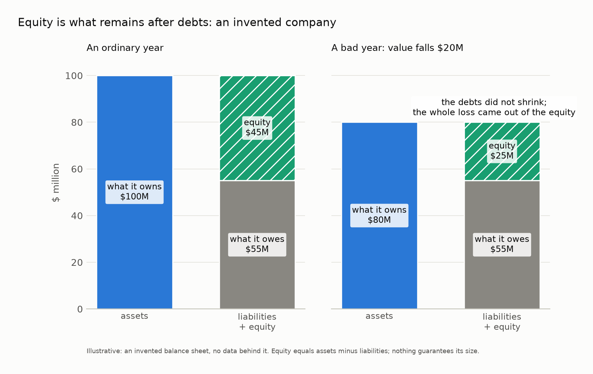
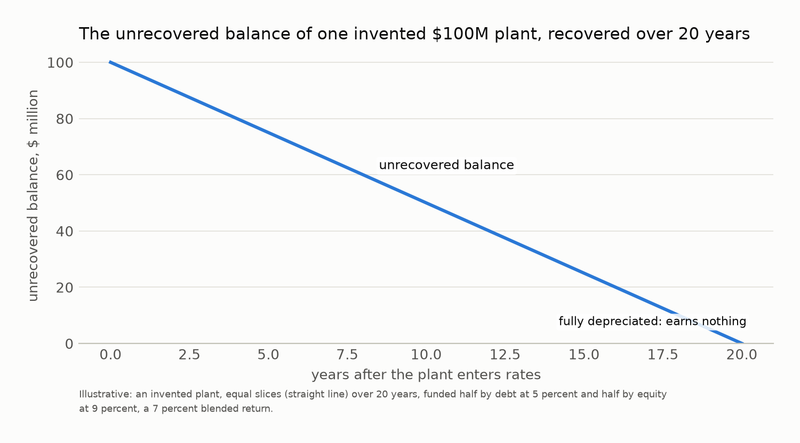
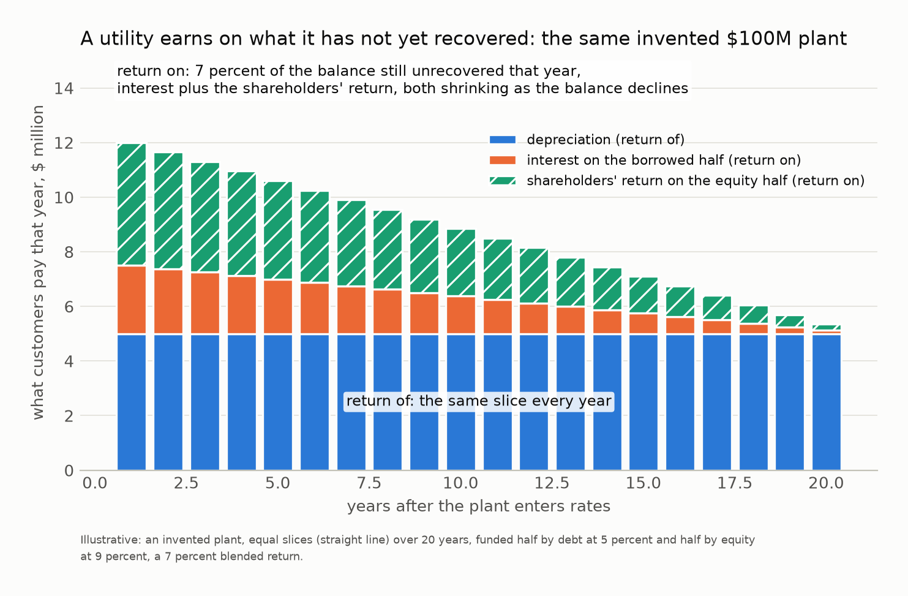
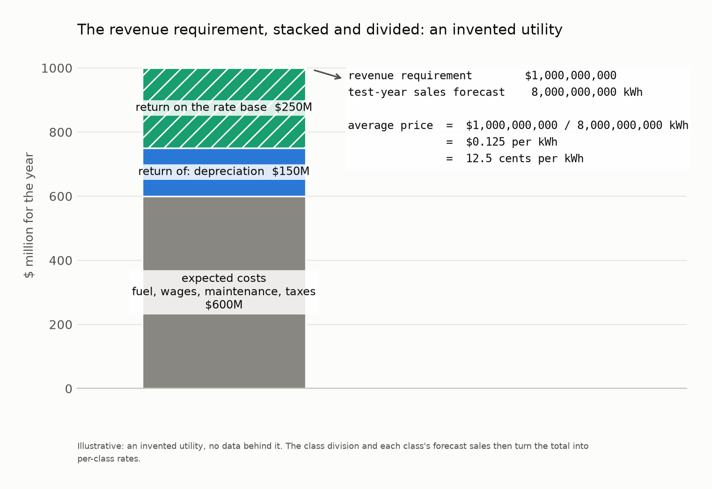
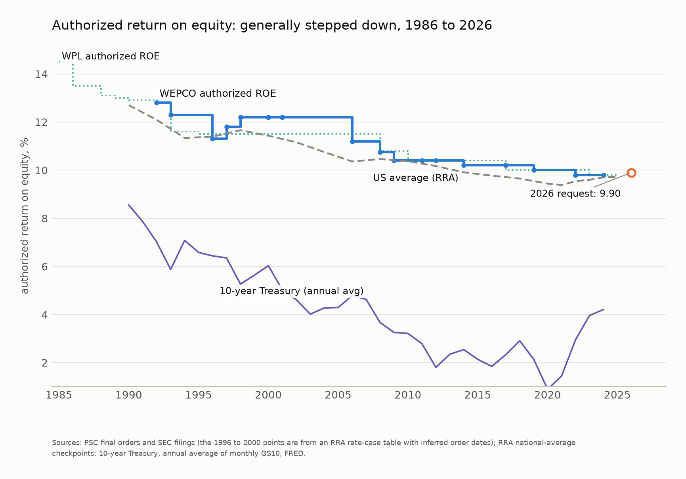
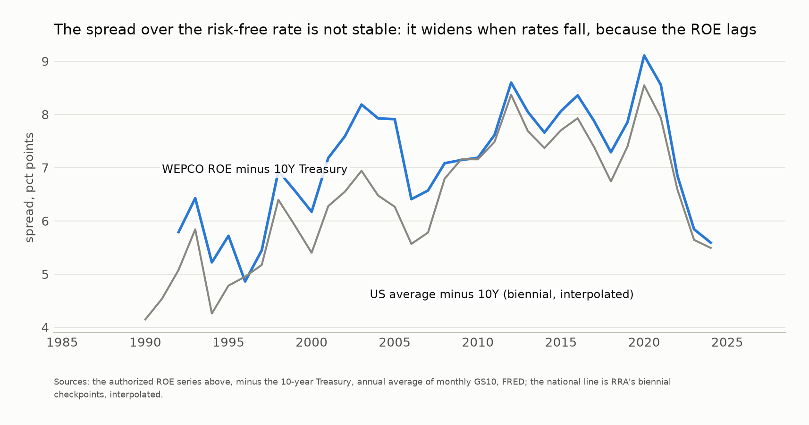
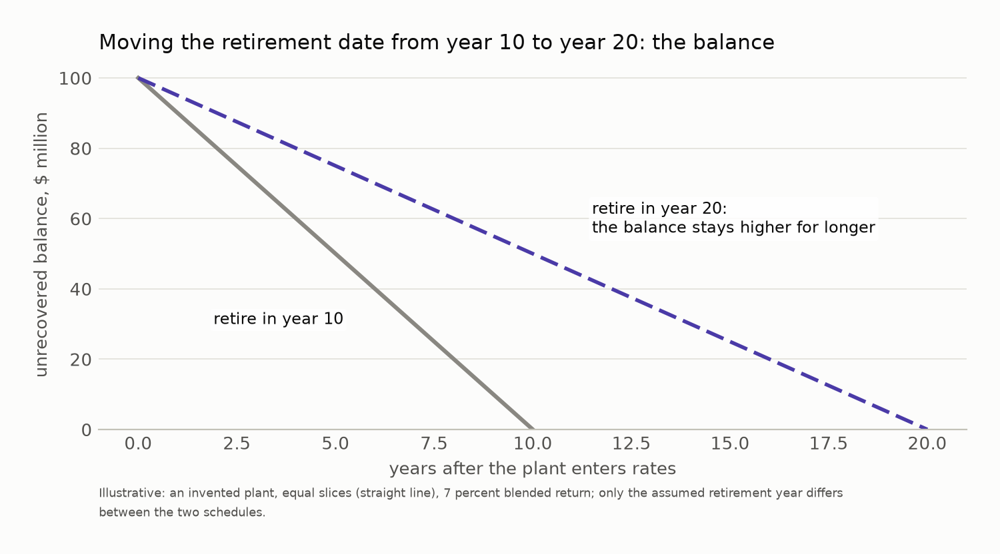
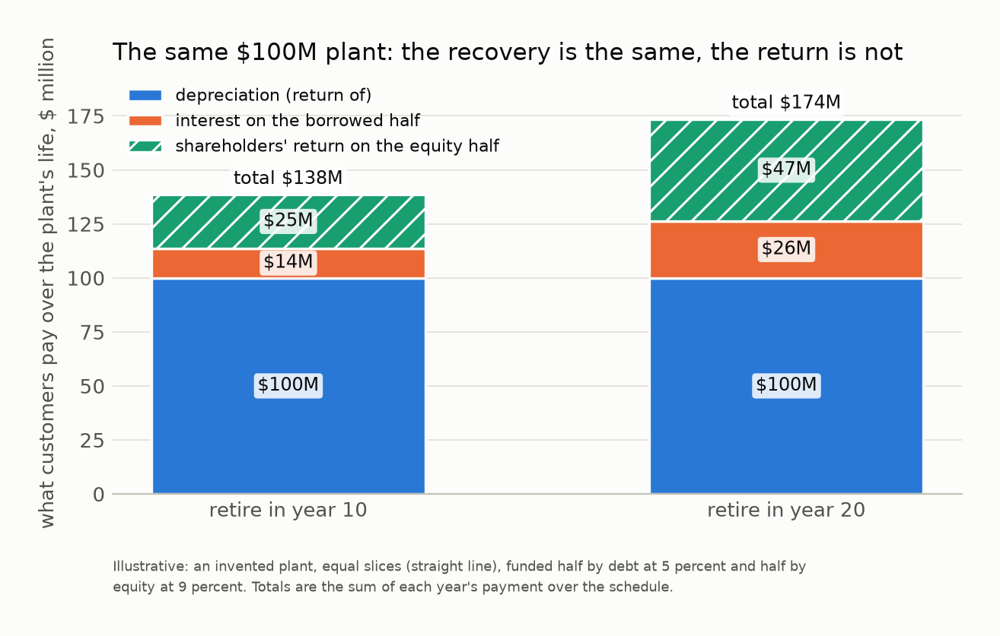

## Introduction

This guide explains how an investor-owned electric utility works as a business: where its money comes from, what regulation allows it to earn, and how those decisions become the rate on your bill. It assumes no background in finance. It covers five things:

1. Where the money comes from: what lenders are promised, what shareholders own, and why the difference matters.
2. What regulation is: why the state sets the price of electricity, and the bargain that comes with the monopoly.
3. How rates are made: the total the utility may collect, the division of that total among customer classes, and the published approved conditions, terms, and prices of utility services.
4. What sets the profit inside that total: the return on equity, the equity share, and the three decisions about the balance the return depends on.
5. What is particular to Wisconsin, with We Energies as the running example.

This is a concise but in-depth guide. Every state with investor-owned utilities runs the same basic system. The primers listed under [Further reading](#further-reading) treat each piece in more depth, and the Regulatory Assistance Project's guide is the one to start with.

## Why a utility needs money it does not have

Electric utilities are among the most capital-intensive businesses around. Power is delivered by expensive equipment built to serve for thirty or forty years. Power plants, substations, and the wires down your street cost more to build and install than the utility collects in a year.

So the money to build comes from somewhere other than this year's bills. It comes from investors, who supply money now in exchange for a return later.

## The two ways a company raises money

A company can raise money in two ways.

1. **Debt.** Borrowing works similarly to a mortgage or a car loan. The lender hands over money against a contract that states the interest rate, the payment dates, and when the loan is paid off. Utilities borrow mostly by selling bonds, which are that contract in a publicly traded form. Rating agencies grade each company's bonds on how likely the payments are to arrive on time, the way a credit score grades a household, and a better grade means lower interest.
2. **Equity.** An investor may purchase shares. Each share is a piece of the company. A shareholder is paid in two non-guaranteed ways: dividends, which the company's board declares at its own discretion, and whatever the shares fetch when sold.

The mix of the two is the company's capital structure. For American utilities, roughly half the money is borrowed and the rest comes from shareholders.

## What the owners own

Everything the company owns was paid for with those two kinds of money. A balance sheet is the record of that. One side of the balance sheet lists everything the company owns, its _assets_. The other side lists everything it owes, its _liabilities_. The shareholders' claim is the difference between the two.

That difference is the equity. Take the company's total assets minus its total liabilities to determine the shareholders' equity. Nothing guarantees its size or its sign.

Debts do not shrink when business goes badly. The lender is owed what the contract says, in a good year or a bad one. So when the assets of the company fall or rise, that change is solely on the shareholders. That is the risk of owning.

In what order are bills paid? Generally, revenue pays in order:

1. the operating costs: employees, contractors, fuel, and the other bills;
2. the interest the debt contracts require;
3. the owners, from what is left.

If the company fails, its assets are sold and the claims are paid in order:

1. lenders whose debt is secured by a pledge of specific property, paid from that property, the way a mortgage lender takes the house;
2. the costs of keeping the system running through the failure, since the utility does not stop operating;
3. wages earned shortly before the failure, up to a capped amount per employee;
4. everyone else owed money without a pledge, sharing what is left in proportion to what they are owed: unsecured lenders, unpaid suppliers and contractors, and any wages above the cap;
5. debt that agreed to stand behind the others, called subordinated;
6. the owners, who take whatever remains, which is often nothing.

Why would anyone then choose to become a shareholder? The answer comes where the return on equity is reviewed.

## What counts as capital

In any given year, a utility has a variety of expenditures. These are generally divided into two categories, _operating expenses_ and _capital expenditures_. What separates the two is how long the thing lasts.

Operating expenses include things like:

- fuel for the power plants, and power bought from other generators;
- wages and benefits for the people who run and maintain the system;
- repairs to plants, lines, and substations;
- taxes, insurance, and the cost of running the offices.

Capital expenditures include items like:

- power plants and the equipment inside them;
- transmission lines and the substations that connect them;
- distribution: the poles, wires, transformers, meters, and service drops down your street;
- buildings, trucks, and computer systems.

Fuel is burned in the year it is bought, and a line crew's wages pay for this year's work. Spending like that is an operating expense, used up in the year it is spent. A transformer serves for decades. Under accounting rules, anything installed with an expected service life of more than one year is recorded as plant. The company's annual report calls the same thing property, plant, and equipment, or PP&E. The regulator's books call it plant, and this guide does too. Spending that creates plant is capital expenditure, or capex.

An operating expense is recovered in the year it is spent. Plant is recovered across the years it serves. Money spent on plant becomes an asset recorded at what it cost and depreciated on a schedule. More on this later.

## Return of, and return on

When a utility builds a power plant, it pays for it during construction, before the plant serves a single customer. That capital expenditure is then recovered from customers over the lifetime of the plant. The accounting splits the recovery in two. One part returns the cost. The other pays the investors, lenders and shareholders alike, for the use of their money for as long as the cost is outstanding.

The first is **return of** capital. The plant loses value as it is used up over its service life, and that loss of value is an expense the utility incurs, the same as fuel or wages. Accountants call the expense _depreciation_. Instead of arriving all at once, it is recognized a slice at a time across the years the plant is expected to serve. For this guide we use straight-line depreciation, which assumes the slices are equal every year.

Like fuel and wages, depreciation is recovered dollar for dollar. The utility collects the year's slice and earns nothing on it. It is not profit. It is recovery of what the plant cost.

The books record this with two accounts. The plant itself stays on the books at what it cost, for as long as it is in service. Beside it sits the _accumulated depreciation balance_, and each year's slice is added to it. The unrecovered balance is the difference between the two, the plant's cost less the accumulated depreciation. The slice also carries a share of what it will cost to remove the plant at the end of its life, so the accumulated balance collects the removal money in advance, years before the wrecking crews arrive.

That accumulated balance is large. In We Energies' filing for 2027, electric plant in service is \$13.1 billion and the accumulated depreciation balance is \$4.3 billion, a third of it. Customers earn no interest on that money, and it is not set aside anywhere: a depreciation reserve is an accounting balance, and the cash it represents has gone into new plant and the rest of the business. What customers get instead is the subtraction. The accumulated balance is deducted from the _rate base_, the company-wide total of unrecovered cost that the return is earned on, so the utility earns its return only on the two-thirds not yet recovered. Every dollar collected in advance is a dollar the utility stops earning on.

The second is **return on** capital. Every year, the utility earns a percentage on that unrecovered balance. Part of that percentage covers the interest on the money the utility borrowed. That part is mostly treated as a fixed cost. The rest is the return on the shareholders' investment.

A dollar spent on fuel is a dollar recovered. A dollar spent on a plant is a dollar recovered plus years of return on the balance while it is being recovered.

Nothing on a bill separates the two. A residential bill shows a fixed monthly charge and a price per kilowatt-hour, and both kinds of recovery are inside that price. As depreciation removes cost from the books, the balance shrinks, and the return shrinks with it. A plant that has been fully depreciated earns the utility nothing.

Then why does the balance never reach zero? Because while one plant may be paid off, the utility builds new facilities. The whole system always maintains a positive capital position. It is increasing when plants are being built faster than depreciation removes the capital.

### A utility earns on what it has not yet recovered

The two charts below show this for an imaginary \$100 million plant recovered over twenty years, funded half by borrowing at 5 percent and half by shareholders at 9 percent, a 7 percent blended rate. The numbers are invented, chosen to be round and near the real ones. The first chart shows the unrecovered balance falling in a straight line to zero.

The second shows what customers pay for the plant each year, split three ways. The blue portion is the depreciation slice, the same every year. The orange portion is the interest on the borrowed half, and the hatched teal portion is the shareholders' return on the other half. Both parts of the return shrink as the balance declines, and only the teal portion is profit.

The orange portion is what customers are charged for the borrowed money, not what the debt holders receive. A bond pays a level amount of interest each year and returns its principal at maturity, and the utility covers that from the depreciation it collects.

## What regulation is, and who does it

Why does a state commission set the price of electricity at all? Utilities are considered a natural monopoly because a single company can supply an entire market's demand at a lower average cost than two or more companies could.

In a competitive market, a customer who dislikes a price or product buys from a competitor. That competition is what restrains price and ensures quality. A utility customer has no other company to turn to. So the state grants the monopoly and regulates the price and terms of service.

The utility gets a monopoly and a regulated return in exchange for the obligation to serve everyone at the prices and on the terms the state sets. This is called the _regulatory compact_. If the return is set too high, everyone the utility serves is overcharged. If the return is set too low, investors stop supplying the money the next plant requires. Then customers pay for that instead, through the higher return the utility must offer shareholders and the higher interest it must pay lenders to raise capital. The standard the federal courts set in the 1920s and 1940s covers this: the return should be enough to maintain the utility's credit and attract the capital its obligation requires, and no more than that.

In Wisconsin the regulator is the Public Service Commission (PSC). State statute hands it the standard but no method to determine rates. Charges must be "reasonable and just," and when the Commission finds existing rates "unjust, unreasonable, insufficient" or otherwise unlawful, it must set reasonable ones. Insufficient is the statute's word for the too-low side.

The argument in a rate case is never about whether a return should exist. It is about the size of that return.

## How those payments become the rate on your bill

In a rate case, the utility and the PSC determine three numbers:

- the _revenue requirement_, the total the utility may collect;
- the _sales forecast_, how much electricity customers are expected to buy;
- the _rates_, the first divided by the second, worked out for each customer class.

Rate cases are generally every two years.

### Revenue requirement

The first number is the total the utility is allowed to collect. It equals the sum of a year of expected costs, the **return of** slice, which is depreciation, and the **return on** the unrecovered balance. Regulators call that sum the revenue requirement. Typical expected costs include fuel, wages, maintenance, and taxes. The total of a utility's unrecovered balance, across every plant, wire, and substation, is called the _rate base_.

The PSC sets two percentages against the rate base. The first is the profit rate on the equity portion. The equity portion is the share of the rate base funded by the shareholders in the company. The filings call that profit rate the return on equity (ROE). The blended percentage on the whole balance, debt included, goes by rate of return. When you read that the utility asked for 9.90 percent, that is the ROE. The second percentage the PSC sets is how large the equity portion is.

The utility proposes both percentages in its application. The Commission's staff, the state's consumer advocate, and other customers can counter with their own. The PSC decides among them after the argument, or it approves a settlement among them.

The current case sets rates for two test years. The utility asks for a revenue requirement of \$3.96 billion for its Wisconsin retail customers in 2027 and \$4.14 billion in 2028, 7.3 percent and 12.1 percent more than current rates collect. Its annual report gives the reasons: capital investment in new wind, solar, battery storage, and natural gas generation; reliability investment in the distribution system, including burying lines; and changes in its wholesale business with other utilities. Most of that is new plant entering the rate base, so most of the increase arrives as depreciation and return rather than as operating cost.

### Sales forecast

The second number is a forecast of how much electricity customers are expected to buy. The period the forecast covers is called the _test year_: the costs and the sales are both estimated for the same span, so that the total collected matches the total spent. In Wisconsin a rate case sets two test years, the two calendar years after the year the case is decided. The current case, decided in 2026, uses 2027 and 2028. The Commission approves the forecast in the rate case, alongside the revenue requirement it divides.

### Rates

The third number is the division. Customers are grouped into classes for billing: residential, commercial, industrial, and a few specialized others. A cost study splits the allowed total among the classes, and each class's share, spread across that class's forecast sales, becomes a price per kilowatt-hour.

If sales fall, the same revenue requirement is divided by fewer kilowatt-hours. Thus the price per kilowatt-hour increases.

The chart below draws the whole calculation for an imaginary utility. The bar stacks the year's expected costs in gray, the depreciation slice in blue, and the return on the rate base in teal, adding up to the revenue requirement. To the right, that total is divided by the test-year sales forecast, and the result is the average price per kilowatt-hour.

## The company's profit

Five decisions set the profit on a plant. These are determined in proceedings before the PSC.

1. The *return on equity* sets the rate.
2. The *equity share* sets how much of the unrecovered balance that rate applies to.
3. The *depreciation schedule*, and for a plant its retirement date, sets how long the balance lasts.
4. The *treatment of a closed plant* sets whether its unrecovered balance keeps earning after it stops running.
5. *Securitization* can refinance the balance and end the return on it.

### Return on equity (ROE)

The interest on the utility's debt is contractual. The return to shareholders is estimated, argued, and set in the PSC.

The chart below draws the authorized return at We Energies since 1986 against the national average and the yield on 10-year government bonds. The dotted line is Wisconsin Power and Light, another of the state's large investor-owned utilities, drawn to show that the pattern is not particular to We Energies.

Government bonds pay a modest return and almost never fail. Anything less secure must offer a higher return. That is the risk premium paid for the lower safety of the investment. How large it needs to be depends on the investor's perceived risk. A regulated monopoly is a low-risk business. It has a fixed territory and rates set by the state. Utility stock prices are generally less volatile than the stock market as a whole. Debt rating agencies weigh the quality of a utility's regulation directly in its credit grade. The ROE the PSC sets is its estimate of what those investors require to become or remain shareholders. The rate the PSC determines is applied to the plant's unrecovered balance and the approved equity share, not the market price of the shares.

Various parties argue for different numbers. In the current case, the utility asks for 9.90 percent, the PSC's staff recommends 9.50 percent, and the state's consumer advocate says 9.10 percent. All three come from financial models fed different assumptions, and one assumption, the size of the risk premium investors demand for holding stocks, does much of the work. The utility's witness uses 8.2 percent for that number, while the staff and the consumer advocate both use 5 percent. That number is the extra return investors expect from stocks as a whole over government bonds. It is an input to the models, not the premium the utility itself is granted.

The authorized rate has generally decreased for forty years. Interest rates fell across most of that span but have risen since 2020.

The next chart draws the utility's own premium: the authorized rate minus the yield on 10-year government bonds. It widened as bond yields fell through the 2010s and narrowed after 2022 as they rose. The authorized rate lags in both directions. Wisconsin's premium tracks the national one closely throughout.

### Equity share

The *equity share* is the portion of the unrecovered balance that the rate case treats as funded by shareholders. The shareholders' equity provides a cushion that absorbs losses. The thicker that cushion, the less likely a debt holder goes unpaid, and lenders price that into the interest they require.

The equity share matters to your bill in two directions.

- Thin the equity and the borrowing costs more. Less equity usually means a weaker credit rating, and the return the remaining equity requires goes up with the extra risk.
- Thicken the equity and customers pay more directly. The utility deducts the interest it pays from its taxable income, while the shareholders' return is taxed, so every point of equity carries both the higher return and the tax on it.

The share is not a number the PSC randomly picks. It starts from the utility's balance sheet, recorded under the uniform system of accounts, projected forward to the test year. The utility proposes that structure, or a number near it, and the PSC reviews it. American utilities typically carry between 40 and 60 percent equity. The Commission-determined equity share departs from the utility's books only when the actual share sits far outside the norm, or when a parent company's other businesses distort it. We Energies' authorized share is 53 percent.

Once the PSC sets the equity share, the utility is legally obligated to hold it. Its current rate order bars the utility from paying its parent company more in dividends than the rate case assumed, if paying more would drop the equity share below the authorized level.

### The depreciation schedule and the retirement date

Every class of asset has a depreciation schedule. For most assets the schedule is routine. Trucks and computers are written off over fixed lives according to the year they were bought. Poles, wires, and meters get an average life from the utility's own retirement records, which go back to 1927. A power plant is different. Its schedule runs to the year the plant is expected to stop running. That date is a judgment call. The schedule for any asset is built from three inputs:

- **The cost to recover.** This is the original cost, adjusted for what the retired asset will bring as scrap minus what it will cost to remove. For a power plant there is usually a removal cost that is greater than the scrap value.
- **The service life.** A plant's service life ends in the year it stops providing the service.
- **The method.** How the cost is spread across the service life. Straight line takes an equal slice every year. Other methods have larger slices in early years and smaller slices near the end of its service life.

A plant expected to close in ten years is recovered over ten years. Move the close date to twenty years, and the same cost spreads over those twenty. The size of the annual slice drops but the unrecovered balance stays higher for longer. So the return earned by the utility also lasts longer.

The two charts below show this for the same imaginary \$100 million plant, retired in year ten or retired in year twenty. The first shows the unrecovered balance under each date, the ten-year schedule in gray and the twenty-year in violet.

The second shows what customers pay each year under each schedule, one panel for each date. Each year's bar is split the same three ways as before: the blue portion is the depreciation slice, the orange portion is the interest, and the hatched teal portion is the shareholders' return.

The next chart adds up what customers pay over the whole life under each date, split the same three ways as before. The depreciation is \$100 million either way: the plant cost what it cost, and the date changes only how fast that is recovered. The interest and the shareholders' return are what the date changes. Doubling the life from ten years to twenty roughly doubles both, because the balance they are earned on stays on the books longer.

In order to determine a plant's service life, the utility hires a consultant who estimates that life "based on consultation with Company management, financial, and engineering staff." Management takes that study and proposes it to the PSC. Then the PSC, in a public docket separate from the rate case, reviews it, may adjust it, and certifies it.

In the most recent study, thirteen of We Energies' gas combustion turbines had their expected closing dates extended by exactly five years each. Recalculating the retirement date is not unusual. We Energies files a new study, covering multiple plants, about every four years. The study takes the unrecovered balance as it stands, subtracts the expected net salvage, and spreads the remainder over the years to the new date.

### What happens when a plant closes

Closing a plant does not end the payments.

Every plant carries an unrecovered balance while its depreciation schedule applies, and the balance reaches zero on the retirement date the schedule assumed. A plant that closes before that date leaves a balance behind. The utility moves it into a separate account as a _regulatory asset_. That balance leaves the plant accounts but not the rate base. The utility keeps collecting the annual slices from the old schedule until the balance is depleted.

Oak Creek Power Plant units 5 and 6 stopped generating electricity in May 2024. At the end of 2025 their unrecovered balance stood at \$68.3 million, and We Energies has approval "to collect a return of and on the entire net book value" of those units.

We Energies carries \$634 million in unrecovered balances from plants it has retired or abandoned. It has approval to collect the recovery, and for all but \$100 million it collects the return as well.

### Securitization

_Securitization_ is the process of converting an illiquid asset with a defined cash flow into a marketable debt security. It provides a defined income stream to purchasers of that debt security, and it hands the utility its unrecovered balance immediately.

Instead of the utility carrying the unrecovered balance and earning its authorized return on it, the balance gets refinanced with special low-cost bonds, backed by a dedicated charge on customer bills that cannot be waived or bypassed. That guarantee is what makes the bonds cheap. Customers still cover the balance through the charge. What ends is the return above the bond rate.

Wisconsin has already done this once. The \$100 million of retired-plant balance on which We Energies collects no return is Pleasant Prairie's environmental controls: in November 2020 the Commission approved securitizing that balance, and the bonds it produced carry 1.578 percent interest. Wisconsin's statute allows it for environmental control property, the pollution controls rather than the plant, and only the utility can apply for the financing order.

For scale: the utility's own application compared a bond rate of around 2.5 percent with its pre-tax cost of capital of 9.54 percent, and put the saving on the \$100 million at about \$40 million over the life of the bonds. The bonds came in at 1.578 percent.

## Rate classes

A rate class is a group of customers who share cost characteristics and who are billed under the same schedule. We Energies' cost study in the current case uses ten classes:

1. residential flat;
2. residential time-of-use;
3. secondary small flat;
4. secondary small time-of-use;
5. secondary medium;
6. secondary large time-of-use;
7. general primary;
8. street lighting and other;
9. dedicated renewable energy rider;
10. renewable premiums.

The terms secondary and primary refer to voltage levels. Secondary customers take power at the same low voltage as homes, from the small shop to the mid-sized building. General primary customers take power at high voltage. They are the large industrial and commercial loads. The terms flat and time-of-use are two pricing schedules for the same customers, one price all day or a price that changes by hour. The last two are riders for customers who pay extra for a dedicated renewable supply.

The characteristics that sort customers into classes:

- the voltage at which the customer takes power;
- how much energy it uses;
- the shape of its use across the day and the year;
- how it is metered;
- the terms of service.

More rate classes means closer matching but more administration, so the number of classes stays limited.

How does the cost study divide the allowed total among the classes? The total is the test-year revenue requirement, every dollar of expected cost, depreciation, and return for the test year. The study does this in three steps. Each step determines one thing about every dollar.

1. *Functionalization* determines which part of the system the dollar paid for. Other utilities may draw them differently, but We Energies' study uses four functions.
    - *Production*: the power plants and the fuel they burn.
    - *Transmission*: the high-voltage network that moves power across the state.
    - *Distribution*: the lower-voltage network that delivers it down your street, the poles included.
    - *Customer*: the metering, billing, and customer service that every account needs regardless of how much power it uses.
2. *Classification* determines what makes the cost bigger or smaller. The study recognizes three kinds, and every dollar gets exactly one.
    - *Energy*: the cost grows with the kilowatt-hours consumed. Fuel is the clear example.
    - *Demand*: the cost grows with the size of the load at the system's busiest hours. The plants and wires are sized to carry the peak demand.
    - *Customer*: the cost grows with the number of accounts. Meters, meter reading, and billing.
3. *Allocation* determines each class's share by that measure.
    - A class that uses 63 percent of the energy carries 63 percent of the fuel cost.
    - A class that is a third of the load at the system peak carries a third of the costs that were sized for the peak.
    - A class that is half the customers carries half the metering and billing.

*Cost causation* is the principle that a cost is carried by whoever caused it to be incurred. The three steps apply it to the revenue requirement.

The three steps together are the cost-of-service study (COSS) and its result is one schedule in the utility's filing, Ex.-WEPCO WG-Nelson-6, Schedule 5, in docket 5-UR-112. Here is a piece of it for 2027, the first of the case's two test years, in millions of dollars: the four functions, and two of the ten classes, residential flat and general primary. The 2028 page is Schedule 11 of the same exhibit. The first column is every class together, so the two class columns do not add up to it. The other eight classes hold the difference.

| | All customers | Residential flat | General primary |
|---|---:|---:|---:|
| Production | 2,387 | 899 | 536 |
| Transmission | 465 | 182 | 100 |
| Distribution | 930 | 608 | 51 |
| Customer | 176 | 141 | 5 |
| **Cost of service** | **3,959** | **1,830** | **692** |
| Customers | 1,186,458 | 1,046,395 | 500 |
| Energy sold, million kWh | 23,132 | 7,629 | 6,509 |

<small>We Energies' 2027 cost of service by function, in millions of dollars, for all customers and two of the ten rate classes. From Schedule 5 of the utility's cost-of-service study in docket 5-UR-112.</small>

Read down each column and the two rate classes are made of different costs. Half of the residential flat class's cost is production and a third is distribution. Three-quarters of the five hundred primary customers' cost is production and 7 percent is distribution. General primary has low distribution because they take power at high voltage and the utility owns nothing between the substation and the meter. Read across the distribution row and the residential flat class carries 65 percent of it while buying a third of the energy.

## From the cost study to the tariff

Schedule 5 says what each class costs to serve. Three more steps turn that into the prices on a bill.

The PSC determines the *revenue allocation*, the applied allocation of costs to customer classes. It uses the cost study as its starting point. The utility proposes, and its witness describes the proposal as moving "towards the results of class COSS while balancing other rate design considerations, including rate stability and gradualism," with a design "intended to avoid giving some customer classes large decreases while others receive large increases." In the current case the utility proposed every class at its cost, within rounding, so the gaps in the study became the requested increases: 10 percent for residential flat and 6 percent for general primary in 2027, and 16 percent and 9 percent by 2028.

*Rate design* turns each class's revenue into the charges on its bill. Three kinds of charge are in use:

- an *energy charge*, a price per kilowatt-hour;
- a *demand charge*, a price per kilowatt of the customer's own monthly peak, applied to large customers;
- a *customer charge*, a fixed amount each month for the costs that come with an account however little it uses.

These correspond to the three kinds of cost from the classification step, but not exactly. The study allocates demand cost by a class's share of the system's busiest hours, while a demand charge bills a customer's own monthly peak, whenever it falls. A residential bill has a customer charge and an energy charge but no demand charge, so the demand costs allocated to residential customers are recovered inside the price per kilowatt-hour.

*The tariff* publishes the result. It is the legal document listing every rate schedule, the charges under each, and the terms on which service is taken. Each cost-study class maps to one or more schedules: residential flat is billed under Rg-1, farms under Fg-1, and general primary under the Cp schedules. The PSC approves the tariff, and the utility must charge what it says, no more and no less, until the PSC changes it.

Here is the Rg-1 sheet as it stands: Sheet 21 of the utility's electric tariff, effective January 1, 2026, under the Commission's order in the last rate case:

| Rg-1 residential service | Rate |
|---|---:|
| Customer charge, per day | \$0.49315 |
| Energy charge, per kWh | \$0.19342 |
| Fuel cost adjustment, per kWh | \$0.00199 |
| Environmental control charge, per kWh | \$0.00052 |

<small>We Energies' residential rate schedule Rg-1 as it stands: Sheet 21 of the utility's electric tariff, effective January 1, 2026.</small>

The customer charge is the fixed monthly amount, about fifteen dollars a month. The energy charge is the price per kilowatt-hour, and it is the number the rate case proposes to move, to 21.565 cents in 2027. The fuel cost adjustment tracks the year's fuel price against what the rate assumed. The environmental control charge is the securitization charge from the section above, the one that cannot be waived or bypassed.

## Why the classes move differently

The two rate classes in the table are made of different costs, so they respond to different forces. A factory's rate is mostly production, so it falls fastest when fuel gets cheap. A household's rate is a third distribution, so it rises fastest when the utility invests in delivery, and the state's planning assessment reports distribution as the fastest-growing piece of the total, at 9.2 percent a year. Falling use per home raises the residential average on its own, since the delivery system's cost is fixed and the same cost is spread over fewer kilowatt-hours.

## How much of this is Wisconsin

Mostly this is standard American utility regulation. Four things are more particular to Wisconsin.

The first is who owns the biggest transmission lines. In 2001, Wisconsin's utilities placed their high-voltage transmission into a separate company created through legislation. That company is American Transmission Company (ATC), which owns transmission and nothing else and calls itself the nation's first multi-state transmission-only utility.

ATC's charges are set by federal regulators under a formula, not by the state commission; the regional grid operator, MISO, divides the cost of big new lines across the states that benefit. What the Wisconsin commission decides is how that cost is split among customer classes.

The second is the test years used. Wisconsin sets rates on a forecast of the next two years. Some states look backward at a historical year instead.

The third is that Wisconsin has no retail choice. Your utility is the only company that may sell you power. Illinois and Michigan have opened their markets to competing suppliers, Illinois fully and Michigan up to a tenth of each utility's sales.

The fourth is the reach of securitization. Wisconsin's law allows the bonds for environmental control property. Several states have written broader laws since 2019. Missouri's covers "the undepreciated investment in the retired or abandoned... electric generating facility."

## The room where it happens

Two proceedings matter, and they get different attention.

The rate case, docket 5-UR-112, sets what you pay starting in 2027. As of September 2026 it has more than two thousand filings, and public comments arrive daily.

The depreciation proceeding sets the retirement dates and depreciation schedules that determine how much profit accrues and for how long. The last one, docket 5-DU-103, drew seventeen documents total: an application, two rounds of questions from a single Commission analyst, and a final decision. The current one, 5-DU-104, has eleven documents as of September 2026, no intervenors, and no public comments.

---

## Further reading

None of the terms above require a finance background, but each has a longer plain-language treatment elsewhere.

- [Electricity Regulation in the US: A Guide, Second Edition](https://www.raponline.org/knowledge-center/electricity-regulation-in-the-us-a-guide-2/) (Regulatory Assistance Project, 2016). The standard primer on rate cases, rate base, and revenue requirements, written for readers with no regulatory background. The full PDF is free.
- [Shareholders' Equity](https://corporatefinanceinstitute.com/resources/accounting/shareholders-equity/) (Corporate Finance Institute). The remainder-after-debts definition of equity and the balance-sheet arithmetic behind it.
- [What is stockholders' equity?](https://www.accountingcoach.com/blog/what-is-stockholders-equity) (AccountingCoach). The shortest plain statement of the equity identity, and of book value against market value.
- [Secured vs Unsecured Loans](https://corporatefinanceinstitute.com/resources/commercial-lending/secured-vs-unsecured-loans/) and [Senior and Subordinated Debt](https://corporatefinanceinstitute.com/resources/commercial-lending/senior-and-subordinated-debt/) (Corporate Finance Institute). Collateral, and the order in which lenders are paid when a company fails.
- [Cost of Capital and Capital Markets: A Primer for Utility Regulators](https://pubs.naruc.org/pub.cfm?id=CAD801A0-155D-0A36-316A-B9E8C935EE4D) (NARUC, 2019). Debt, equity, capital structure, and what investors require, written for regulators new to all of it.
- [Depreciation Expense: A Primer for Utility Regulators](https://pubs.naruc.org/pub.cfm?id=6ADEB9EF-1866-DAAC-99FB-DBB28B7DF4FB) (NARUC, 2021). Regulatory depreciation from the ground up: service lives, methods, and how the schedules are set.
- [Primer on Rate Design for Cost-Reflective Tariffs](https://pubs.naruc.org/pub.cfm?id=7BFEF211-155D-0A36-31AA-F629ECB940DC) (NARUC, 2021). Customer classes, cost allocation, and the charges a tariff is built from.
- [Electricity explained: prices and factors affecting prices](https://www.eia.gov/energyexplained/electricity/prices-and-factors-affecting-prices.php) (U.S. Energy Information Administration). What goes into a retail electric rate nationally, and why residential rates run higher than industrial ones.

## References

This is a guide, so nothing above carries a footnote. Every claim traces to a public record, listed below by the section it supports. We Energies is the trade name of Wisconsin Electric Power Company, which the Commission's filings abbreviate WEPCO; the three names are one company. Commission filings are cited by docket and reference number, and any of them can be pulled up at the Public Service Commission's Electronic Records Filing system by substituting that number into `https://apps.psc.wi.gov/ERF/ERFview/viewdoc.aspx?docid=`. The references and their citation tracking are maintained with Claude AI's help.

**The rate case, and the arguing over the return.** Everything on the current case comes from docket 5-UR-112.

- The three competing returns, 9.90, 9.50, and 9.10: Rebuttal-WEPCO WG-Bulkley, REF# 607541, Figure 1.
- The risk-premium fight, 8.2 percent against 5: Rebuttal-CUB-Kihm, REF# 607622, which quotes Commission staff witness Adams.
- The 2027 revenue requirement, \$3,961,291,691 against \$3,690,935,297 at present rates, 7.32 percent: the Wisconsin total line of Direct-WEPCO WG-Nelson, REF# 586065, Table 1. The 2028 figure, \$4,144,628,637 against \$3,695,873,033, 12.14 percent: Table 2.
- The reasons for the increase: the 2025 Form 10-K's management discussion, which says the requested electric increase "was driven by capital investments in new wind, solar, and battery storage; capital investments in natural gas generation; reliability investments, including grid hardening projects to bury power lines and strengthen our distribution system against severe weather; and changes in wholesale business with other utilities."
- The requested class increases: Nelson, Tables 1 and 2. The ten-class list: Nelson, page 14.
- The revenue-allocation quotations, gradualism and the avoidance of large decreases beside large increases: Nelson, pages 43 to 45. That the proposed increases equal the cost-study gaps within rounding: Table 1, where the proposed and COSS percentages agree to within a few hundredths of a point for every class.
- The mapping of cost-study classes to rate schedules (Rg-1, Fg-1, the Cp schedules): Nelson, Table 4, page 43. That Rg-1 is "a customer charge and a flat volumetric energy charge" with no demand charge, and the energy rate, 19.342 cents per kilowatt-hour under current rates, 21.565 proposed for 2027 and 22.882 for 2028: Nelson, page 45.
- The Rg-1 sheet in the table: Wisconsin Electric Power Company, Volume 19, Electric Rates, Sheet 21, Revision 20, Amendment 813, Rate Schedule Rg 1, issued December 26, 2025, effective January 1, 2026, "PSCW Authorization: Docket No. 5-UR-111 Order dated 12-19-2024," in the tariff volume the utility posts at [we-energies.com/pdfs/etariffs/wisconsin/elecrateswi.pdf](https://www.we-energies.com/pdfs/etariffs/wisconsin/elecrateswi.pdf) and the Commission serves through its tariff viewer. The sheet states the customer and energy charges and refers the fuel adjustment and the environmental control charge to Sheets 19 and 20.2; the two per-kilowatt-hour values for those come from the utility's "2026 Electric rates" brochure, page 3, at [we-energies.com/olb/26/2026-01-we-electric-rates.pdf](https://www.we-energies.com/olb/26/2026-01-we-electric-rates.pdf), which restates the same sheet. The energy charge matches the current rate Nelson cites. The fifteen dollars a month is the daily customer charge times an average month, my arithmetic.
- The class shares of distribution: the utility's own cost study, Ex.-WEPCO WG-Nelson-6, REF# 586051; the class arithmetic on it is mine.
- The four functions and the three measures: the rows of Nelson-6's Schedule 5, the unbundled revenue requirement for each test year, which sorts the total by production, transmission, distribution, and customer, and within each by demand, customer, and energy.
- The table in the rate-classes section: that schedule's 2027 page, columns A, B, and I, the function sub-totals and the customer and energy unit rows, rounded to millions. The percentages in the paragraph under it are my arithmetic on those figures.
- That the utility owns nothing but the meter at a high-voltage customer: Nelson's direct testimony, page 21.

**The retirement date, and the quiet docket.**

- The depreciation study: the Application of Wisconsin Electric Power Company and Wisconsin Gas LLC for Certification of Depreciation Rates, docket 5-DU-104, REF# 583428, prepared by Dane A. Watson of Alliance Consulting Group. The "consultation with Company management" language is its methodology section. The thirteen units with dates moved five years are in its Appendix C, REF# 593217.
- The remaining-life technique, the unrecovered balance less net salvage spread over the remaining life: the same application's description of its method.
- The study cadence: the docket sequence 5-DU-101 through 5-DU-104, with 104 stating that its rates "will supersede those rates previously certified in Docket 05-DU-103."
- The three methods, vintage-group amortization for general plant (continued from 5-DU-103 under FERC's accounting release), actuarial life analysis of retirement records from 1927 to 2024 for mass property, and the life span procedure for production facilities: the same application's testimony and its Attachment 2.
- The previous proceeding: docket 5-DU-103, whose Final Decision, REF# 429718, was signed January 26, 2022.
- The document counts, seventeen and eleven: the docket listings themselves.

**Retired plants, and the securitization.** Wisconsin Electric Power Company, 2025 Form 10-K, filed February 20, 2026, on SEC EDGAR under CIK 0000107815.

- The \$634 million of plant retirement balances, the approval to collect a return of all of them and a return on all but \$100 million, and the \$68.3 million Oak Creek 5 and 6 balance with the "return of and on the entire net book value" language: Note 7. Note 7 does not name the plants behind the \$634 million, but its footnote refers the \$100 million carrying no return to Note 21, the securitization disclosure, which identifies it as the environmental control costs of the retired Pleasant Prairie plant. The same footnote says these balances "are amortized on a straight-line basis, using the composite depreciation rates approved before the plants were retired," and the Oak Creek passage repeats that for units 5 and 6.
- The securitization: the same filing's WEPCo Environmental Trust disclosure, which gives the November 2020 financing order, the \$100 million of Pleasant Prairie environmental controls, and the non-bypassable charge, with the 1.578 percent bond rate in its long-term debt table.
- The 53 percent equity share: its authorized-return table.
- The dividend restriction: the same filing's "Restrictions" disclosure, which says that under the most recent rate order the utility "may not pay common dividends above the test year forecasted amount reflected in our rate case, if it would cause our average common equity ratio, on a financial basis, to fall below our authorized level" of 53 percent. The order is the December 19, 2024 Final Decision in docket 5-UR-111.
- The 2.5 percent against 9.54 percent comparison and the \$40 million saving: the utility's financing application in docket 6630-ET-101, as quoted in Direct-WIEG-Kollen, REF# 605478, page 18. The Financing Order itself, REF# 400098, records the \$100 million as "approximately 100 percent of the remaining book balance of Pleasant Prairie eligible."
- That the statute reaches environmental control property and that only the utility may apply: Wis. Stat. 196.027(1) and (2)(a).

**Why the classes move differently.**

- The 9.2 percent annual growth in distribution costs: Figure 5-3 of the Draft Strategic Energy Assessment 2032, docket 5-ES-113, REF# 595734.

**The authorized return over forty years.**

- The two Wisconsin series, We Energies and Wisconsin Power and Light: built from Commission final orders and from the rate-case tables in the utilities' annual reports and SEC filings. The We Energies points from 1996 to 2000 come from a Regulatory Research Associates table with order dates inferred, which is the weakest stretch of it.
- The national comparison: RRA's periodic average.
- The 10-year Treasury series on the ROE chart: the annual average of monthly yields from the St. Louis Fed's FRED database, series GS10.

**What is particular to Wisconsin.**

- American Transmission Company describes itself as "formed through legislation" in 2001 and as the first multi-state transmission-only utility; the wording is from its own U.P. Energy Summit presentation, John Flynn, October 26, 2011, posted at atcllc.com, and the same self-description runs through its current site.
- Illinois retail choice: 220 ILCS 5, Article XVI, the [Electric Service Customer Choice and Rate Relief Law of 1997](https://www.ilga.gov/documents/legislation/ilcs/documents/022000050K16-101.htm).
- Michigan's cap: MCL 460.10a(1)(a), at legislature.mi.gov: "no more than 10% of an electric utility's average weather-adjusted retail sales for the preceding calendar year may take service from an alternative electric supplier at any time."
- Missouri's securitization definition: RSMo 393.1700(1)(7)(a), at [revisor.mo.gov](https://revisor.mo.gov/main/OneSection.aspx?section=393.1700), enacted by H.B. 734 in 2021. Wisconsin's is Wis. Stat. 196.027(1), cited above.

**The general mechanics.** The regulation sections follow the Regulatory Assistance Project guide linked under Further reading.

- Natural monopoly at section 1.1, regulation replacing competition at section 1.3, the regulatory compact at section 1.4, the attract-capital standard with *Hope* and *Bluefield* at section 8.2.5, the test year at section 8.2.1, the revenue requirement at Figure 8-1, rate base at Figure 8-3 and section 8.2.4.
- The capital-structure trade-off, the 40 to 60 percent range, the tax effect of equity, and the hypothetical or imputed structure where the actual one has "excessive or insufficient equity" or significant non-utility operations: section 8.2.5.1, page 55.
- That the capital structure is the recorded balance sheet, debt and equity under the uniform system of accounts, projected to the test year's balance-sheet date: the NARUC Cost of Capital primer's section 4, page 11.
- Wisconsin statute sets no method for the return. It requires only that charges be "reasonable and just" (Wis. Stat. 196.03(1)) and that the Commission order reasonable rates when it finds them "unjust, unreasonable, insufficient" or otherwise unlawful (196.37(1)); settlements are governed by 196.026.

**The finance and accounting mechanics.** The sections on raising money, ownership, capital, and depreciation follow five primers.

- The accumulated depreciation balance and its deduction from rate base: We Energies' own rate base build-up for the 2027 test year, filing requirement FR-25A-Electric, Attachment 01, PSC REF# 585859: plant in service \$13,112,646,112, accumulated depreciation balance \$4,327,246,733, net plant \$8,785,399,379, with deferred taxes and customer advances the only other deductions. That gross salvage and cost of removal are booked to that same balance: the depreciation study, Ex.-WEPCO WG-Zgonc-4, REF# 586070, page 126: "Gross salvage and cost of removal related to retirements are recorded to the general ledger in the accumulated provision for depreciation." The general rule that the built-up balance reduces rate base "so customers are only paying a rate of return on the remaining value": the RAP guide at section 8.2.6.
- Cost of Capital and Capital Markets: A Primer for Utility Regulators (NARUC, 2019): the two kinds of capital and their risk at section 2, bonds and the ratings at section 2.1, the cost of debt taken as the embedded cost of the bonds outstanding at section 5, what leverage does to equity holders at section 2.2, why investor risk reaches customers at section 2.3, utility betas below the market at section 6.3, the rating agencies' weighting of regulation at section 2.1, and the equity premium over debt at section 6.4.
- Depreciation Expense: A Primer for Utility Regulators (NARUC, 2021): the definition at section 2.2, the cost-allocation concept at section 3.2, service life at section 7.1, net salvage at section 6, and straight line at section 8.1.
- Regulatory Accounting: A Primer for Utility Regulators (NARUC, 2019): plant recorded at original cost and the one-year test, from the uniform system of accounts it reproduces. That the annual report carries the same assets as property, plant, and equipment: the balance sheet and Note 7 of the Wisconsin Electric 2025 Form 10-K cited above.
- Primer on Rate Design for Cost-Reflective Tariffs (NARUC, 2021): customer classes at section 2.2.1, cost causation with functionalization, classification, and allocation at section 2.2.3, and the three rate elements, energy, demand, and customer charges, at section 2.3, pages 16 to 17.
- Primer on Primary Drivers of Electricity Tariffs for Utility Regulators (NARUC, 2021): what a tariff is, at its section 2.
- The equity identity, assets minus liabilities: the standard accounting definition; the Corporate Finance Institute and AccountingCoach pages under Further reading state it plainly.
- The order of payment in a failure, for the lenders' tiers, secured debt from its collateral, then unsecured, then subordinated, then owners: basic corporate finance; the two Corporate Finance Institute pages on secured against unsecured loans and on senior against subordinated debt, under Further reading, state it. The places of the running costs and of unpaid wages in that order: the federal Bankruptcy Code's priorities, 11 U.S.C. 507(a), administrative expenses at (a)(2), and wages earned shortly before the filing, up to a capped amount, at (a)(4) and (a)(5), at [law.cornell.edu/uscode/text/11/507](https://www.law.cornell.edu/uscode/text/11/507).

**The charts.** All nine are mine, drawn from the sources above. The equity diagram, the revenue-requirement diagram, and the five invented-plant charts are illustrative arithmetic with no data behind them.
